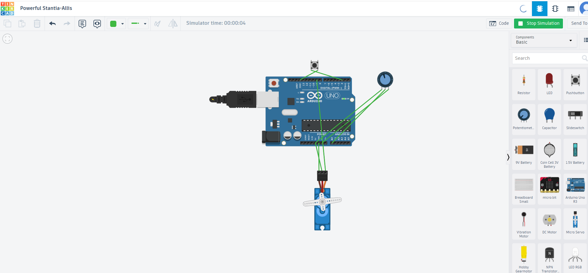

# Precision Servo Positioning System using Analog Feedback

**ServoTrack** — A mechatronic control system demonstrating manual sensor-driven control and setpoint-based position locking using an Arduino Uno, potentiometer, push button, and servo motor.



---

## 1. Objective

Modern automation and precision manufacturing systems — such as laser positioning stages used in solar cell structuring equipment — rely on a core control loop: **sense an input, process it, and actuate a precise mechanical response.** Many of these systems also require the ability to **hold a fixed target position** rather than depending on continuous manual input.

This project implements a small-scale version of that concept:
- A **potentiometer** provides real-time analog input (manual control).
- A **push button** toggles the system into a **locked state**, holding the last commanded position — simulating a setpoint-based automation mode.

The goal was to build, wire, and code this system independently in order to understand the fundamentals of sensor-actuator control loops relevant to mechatronics and automation engineering.

---

## 2. System Architecture

```
   [Potentiometer]         [Push Button]
         |                       |
         v                       v
   Analog Input (A0)      Digital Input (Pin 2, INPUT_PULLUP)
         |                       |
         +----------+------------+
                    v
             [Arduino Uno]
          (reads input, tracks
           mode, computes angle)
                    |
                    v
            [Servo Motor (Pin 9)]
           (moves to target angle)
```

**Control flow:**
1. In **Manual Mode**, the servo continuously follows the potentiometer's position.
2. Pressing the button **toggles Locked Mode** — the servo holds its last angle regardless of further potentiometer movement.
3. Pressing the button again returns the system to Manual Mode.

---

## 3. Components Used

| Component | Quantity | Purpose |
|---|---|---|
| Arduino Uno R3 | 1 | Microcontroller — reads inputs, runs control logic |
| Servo Motor (SG90) | 1 | Actuator — physical positioning output (0°–180°) |
| Potentiometer (10kΩ) | 1 | Analog sensor — manual position input |
| Push Button | 1 | Digital input — toggles manual/locked mode |
| Breadboard + Jumper Wires | — | Circuit assembly |

---

## 4. Working Principle

### Manual Mode (default)
The Arduino continuously reads the potentiometer's voltage (0–1023) and maps it proportionally to a servo angle (0°–180°). The servo follows the dial in real time.

### Locked Mode (toggled via button)
Pressing the button saves the servo's **current angle** as a fixed target and switches the system into a state where further potentiometer movement is ignored. The servo holds this position until the button is pressed again, returning control to the potentiometer.

This mirrors a simplified version of **setpoint control** — a fundamental concept in industrial positioning and automation systems, where a system moves to and holds a specific target rather than requiring continuous manual adjustment.

### Software Design
The code is structured into clearly separated functions rather than a single monolithic loop, following standard embedded software practice:
- `handleButtonPress()` — detects button state transitions and toggles lock mode (with debounce handling)
- `updateServoPosition()` — computes and applies the correct angle depending on current mode
- `logStatus()` — outputs real-time system state via Serial Monitor for debugging and demonstration

---

## 5. Challenges & Solutions

| Challenge | Diagnosis | Solution |
|---|---|---|
| Button appeared to always trigger "locked" mode immediately on startup | Used a minimal test sketch printing raw button state to Serial Monitor; found the pin was constantly reading LOW | Both button legs were on the *same internal side* of the switch (same side of the breadboard's central gap), permanently connecting Pin 2 to GND. Re-seated the button across the gap so each leg connected to a genuinely separate switch contact |
| Multiple rapid toggles from a single physical press | Mechanical switch bounce causes multiple electrical transitions per press | Added a `50ms` delay after detecting a valid press transition (basic debounce) |
| Needed repeatable state control without hardware reset | Initial version only supported one-time locking | Refactored logic to track `lastButtonState` and detect HIGH→LOW transitions, allowing the same button to **toggle** between modes indefinitely |

---

## 6. Code

See [`Servo_Track.ino`](./Servo_Track.ino) for the full source.

```cpp
 #include <Servo.h>

Servo myServo;
int potPin = A0;
int buttonPin = 2;

int potValue;
int angle;
int lockedAngle = 0;
bool isLocked = false;
bool lastButtonState = HIGH;

void setup() {
  myServo.attach(9);
  pinMode(buttonPin, INPUT_PULLUP);
  Serial.begin(9600);
}

void loop() {
  bool currentButtonState = digitalRead(buttonPin);

  // Detect the moment the button is pressed (transition from HIGH to LOW)
  if (currentButtonState == LOW && lastButtonState == HIGH) {
    isLocked = !isLocked;      // toggle: unlocked -> locked, or locked -> unlocked
    if (isLocked) {
      lockedAngle = angle;     // save current angle only when newly locking
    }
    delay(50);                 // simple debounce
  }

  lastButtonState = currentButtonState;

  if (isLocked) {
    myServo.write(lockedAngle);
    Serial.print("LOCKED at angle: ");
    Serial.println(lockedAngle);
  } else {
    potValue = analogRead(potPin);
    angle = map(potValue, 0, 1023, 0, 180);
    myServo.write(angle);
    Serial.print("Manual mode -> angle: ");
    Serial.println(angle);
  }

  delay(15);
}
```

---

## 7. Results

- Manual mode successfully tracks potentiometer input in real time with smooth servo response.
- Locked mode reliably holds the last commanded position regardless of continued potentiometer movement.
- The same button toggles cleanly between modes without requiring a hardware reset.
- System behavior verified via Serial Monitor output and physical servo movement across the full 0°–180° range (the mechanical limit of standard SG90 servos).

---

## 8. Future Improvements

- Replace the potentiometer with a **rotary encoder** for higher-precision, incremental closed-loop feedback (closer to real industrial position sensors).
- Add a **second push button** for explicit unlock, rather than a single toggle button.
- Extend to **multi-axis positioning** using additional servos.
- Integrate a **status LED** to visually indicate current mode (manual vs. locked) without needing the Serial Monitor.

---

## 9. Relevance

This project reflects the same core building blocks found in industrial precision positioning systems — sensing, processing, and actuating — with an added setpoint/lock mechanism analogous to how automated equipment holds a fixed target position during a process step, rather than depending on continuous manual control.
